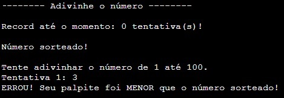
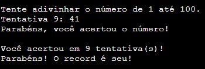
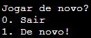

<h1 align="center"> Adivinhe o Número</h1>

Programação do jogo

## 🎯 Funcionalidades
✔️ O programa permite ao usuário adivinhar um número sorteado;  
✔️ O programa permite ao usuário jogar quantas vezes desejar;  
✔️ O programa armazena o record atual e o atualiza a cada jogo;  
✔️ O programa reconhece os erros de entrada.

## 🚀 Linguagens
✔️ Foi utilizado C++ em todo o projeto.

## 🎨 Layout

        
        
       
      
## ⚖️ Licença
✔️ MIT License.

## 🔥 Sobre mim 
  

  
   
  

